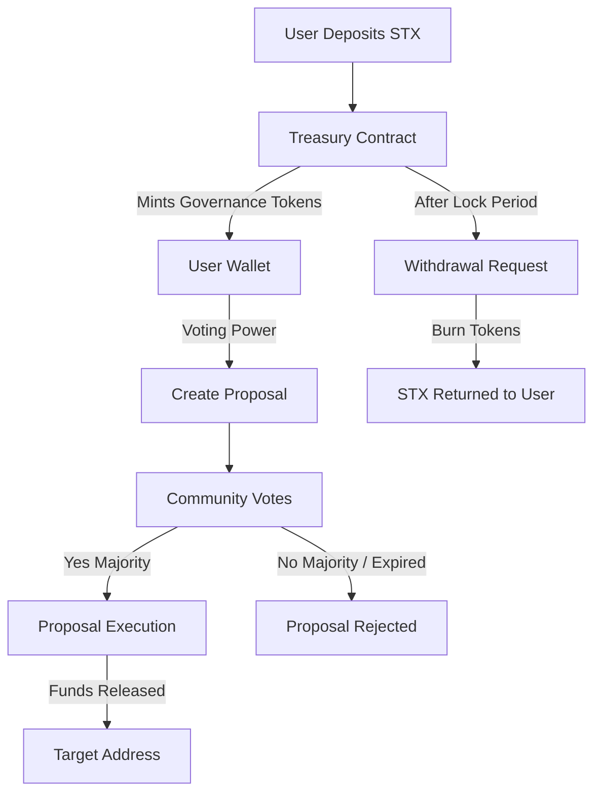

# BitTreasury – Bitcoin-Native DAO Treasury Protocol

**BitTreasury** is a decentralized treasury management protocol built on **Stacks Layer 2**, secured by Bitcoin. It enables transparent, community-driven fund management through **time-locked deposits**, **governance tokens**, and **on-chain proposal execution**.

Designed for **DAOs, investment clubs, and collective funding initiatives**, BitTreasury ensures that treasury operations are secure, auditable, and governed democratically by stakeholders.

---

## 🚀 System Overview

BitTreasury provides a **trustless governance layer** for managing pooled STX assets. Participants deposit STX into the treasury and receive governance tokens on a **1:1 basis**, granting them proportional voting power.

The system enables:

* **Deposits & Withdrawals** – Users lock STX for a defined period, earning governance rights.
* **Governance Tokens** – Minted upon deposit, burned upon withdrawal.
* **Proposal Lifecycle** – Members can propose fund allocations, vote, and execute decisions.
* **Secure Treasury** – Funds are safeguarded under Bitcoin-secured Stacks smart contracts.

---

## 📐 Contract Architecture

The protocol is implemented as a **Clarity smart contract** with clearly defined modules:

### **Core State Variables**

* **total-supply** – Total governance tokens minted.
* **minimum-deposit** – Threshold for deposits (default: `1 STX`).
* **lock-period** – Deposit time-lock before withdrawals are allowed.
* **proposal-count** – Sequential ID tracker for governance proposals.

### **Data Structures**

* **balances** – Governance token balances per participant.
* **deposits** – User deposits with lock and reward metadata.
* **proposals** – Governance proposals with metadata and vote counts.
* **votes** – Vote tracking to prevent double-voting.

### **Core Modules**

1. **Initialization** – One-time setup of the protocol.
2. **Treasury Management** – STX deposits, withdrawals, token mint/burn.
3. **Governance** – Proposal creation, voting, and on-chain execution.
4. **Read-only Queries** – State inspection for balances, proposals, and treasury status.

---

## 🔄 Data Flow

---

## ⚙️ Key Features

* **⛓ Bitcoin-Secured** – Built on Stacks Layer 2, leveraging Bitcoin finality.
* **💰 Time-Locked Deposits** – Governance rights tied to locked capital.
* **🗳 Weighted Voting** – Token-weighted decision-making.
* **📜 On-Chain Proposals** – Automatic execution of approved actions.
* **🔍 Transparency** – Full auditable state via read-only functions.

---

## 📜 Contract Functions

### **Public Functions**

* `initialize` – Sets up protocol (owner-only).
* `deposit` – Lock STX, mint governance tokens.
* `withdraw` – Burn tokens, reclaim STX after lock period.
* `create-proposal` – Submit treasury funding proposal.
* `vote` – Vote for/against a proposal.
* `execute-proposal` – Execute approved proposal and transfer funds.

### **Read-Only Functions**

* `get-balance` – Governance token balance of user.
* `get-total-supply` – Total governance tokens in circulation.
* `get-proposal` – Fetch proposal metadata.
* `get-deposit-info` – Deposit and lock details for user.
* `get-vote` – Check if account voted on a proposal.
* `get-treasury-balance` – Current treasury STX balance.
* `get-protocol-info` – Protocol state overview.

---

## 🛡 Security Considerations

* **Owner Privileges** – Restricted only to initialization.
* **Treasury Security** – Funds never leave contract unless explicitly voted on.
* **Vote Integrity** – Double voting prevented via `votes` map.
* **Execution Control** – Proposals can only be executed once, and only if quorum is met.

---

## 📌 Use Cases

* **DAO Treasury Management** – Community-managed treasuries for DAOs.
* **Investment Clubs** – Collective decision-making for pooled funds.
* **Grants & Funding** – Transparent proposal-based fund distribution.

---

## 📝 License

This project is licensed under the **MIT License**.
